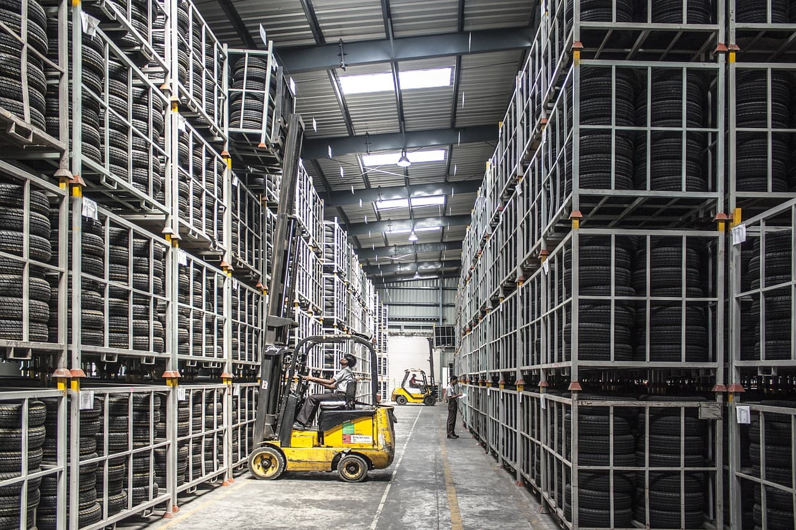

Here's the thing: If we don't put an upper bound on the number of requests a server receives, we may get into a situation in which the server crumbles under the load, trying to serve everything. What's behind this phenomenon is the consequences of how the OS handles work.

<!--more-->

Image credit to [heladodementa on pixabay.com](https://pixabay.com/en/technology-servers-server-1587673/)

Servers have finite resources - the number of CPUs, size of memory, I/O and network speeds, to name a few. The application's performance and ability to utilise the multi-core environment also comes into play. These resources ultimately limit the amount of processing the server can do.

There is a correlation between response times and the number of in-flight requests.

When serving requests, the server spends its resources. Let's consider a situation where an 8-core server needs to process identical requests. Let's assume that when the server is idle, processing takes 200 ms.

The easy one is when up to 8 requests come in at the same time. Given 8 cores, each of them is processed parallelly, and as such, served in 200 ms. (Ignoring a couple of other factors here, such as OS scheduling and processes, and waiting for locks for the sake of simplicity).

If we double the number of requests to 16 and assume that they arrive the same nanosecond, the situation becomes more complicated. Our gut may tell us that the requests are processed sequentially; do the first batch of 8 and then continue in batches until all the requests are processed. Doing it this way would mean that the first batch takes 200 ms to complete, whereas the second batch takes 400 ms (200 ms waiting + 200 ms processing).

Processing the packages. Image credit to [falco on pixabay.com](https://pixabay.com/en/logistics-stock-transport-shipping-852936/)

Process scheduling does not work this way, however. One of the main goals for the Operating System is to keep itself stable and responsive; to achieve such responsiveness, it continuously works to make sure that all tasks get some processing power, all the time. This constant scheduling means that at any given point, the OS may instruct the CPU to stop its work, save the state, switch to another task, load the state, and continue. This procedure is called "context switching", and has a minute cost to it.

The effect is that, on average, the requests complete in approximately 300 ms ((8*200 + 8*400) / 16 = 300 ms).

As an analogy, think of filling up [ice cube trays](https://en.wikipedia.org/wiki/Ice_cube#Ice_cube_tray). Instead of filling up one tray, and only then moving to the next, you move the hose around, filling up each tray to some extent, finally stopping when all of them are sufficiently filled. This way, each tray takes more time to be filled; however, none of them has to wait for too long to be done. It also means some wasted water (work), as some get spilt to the floor when you move the hose (the cost of context switching).

Surprisingly, there aren't many images about people trying to fill ice cube trays with hoses. Image credit to [sevenpixx on pixabay.com](https://pixabay.com/en/dog-garden-terrier-fun-1310545/)

The above is an excellent way to imagine a single-core, single-thread system serving requests. To get to a multi-core, multi-thread system, add more taps or hoses. Of course, not all requests are created equal; some require more processing power, some less. In our example, this means varying the size of the ice cube trays, as that decides how much water we need to fill the tray.

This simplified scenario is what a server does; Receives an ice cube tray, fills it with water with its 8 taps, gives it back. In other words, receives a request, processes it with multiple cores, sends a response.

As we've established previously, these operations take time, and the more time they take, the more ice cube trays can arrive. Similarly, the more ice cube trays are waiting to be filled, the more time it takes for each of them to be filled, on average.

There is a fine line between a server being able to fill the trays on time and being oversaturated with work, not handing out any filled trays in an acceptable timeframe.

16-core system hard at work. Image credit to [ariesa66 on pixabay.com](https://pixabay.com/en/sprinkler-water-hose-connection-2366751/)

Your maximum throughput (the number of completed work in a given timeframe) changes as a result of the workload, but not necessarily the way we think it would change. For the sake of simplicity, let's get back to regular, non-changing tray sizes. If our throughput is 10 trays/second, in a perfect world, that number won't change if we were filling 10 trays or 4 million trays. The time between a tray being accepted and handed back would skyrocket, of course, but at the end, when all 4 million trays are filled, our throughput is still 10 per second (or 4 million in 4.62 days).

We do get waste, however. We have to pay the cost of context switching every time we do it. It's negligible at 10 trays but becomes quite significant at 2000.

Note to self: start reading. Image credit to [ninocare on pixabay.com](https://pixabay.com/en/books-door-entrance-culture-1655783/)

These restrictions are part of the system, and we can't change it. Servers have finite resources, and Operating Systems work the way they do. We can't keep increasing the number of trays to be filled indefinitely. Similarly, we can't control the number of incoming requests apart from rejecting them.

So what can we do?

### Upgrade the server

One of the ways we can handle the need for increased throughput is to add more resources to our server, also called vertical scaling. In our scenario, it means more taps/hoses (processors), higher water pressure (more performant CPUs), or better I/O (faster incoming and outgoing trays).

That said, you can only upgrade a server to a certain extent. At one point, it becomes economically unreasonable to keep improving it. If we go even beyond that point, we'll eventually hit a wall called "physics".

Someone broke physics. Image credit to [Myriams-Fotos on pixabay.com](https://pixabay.com/en/ice-cubes-fire-flame-burn-hot-1914351/)

### Add more servers

Another weapon in our arsenal is to offload the work to other servers, also called horizontal scaling. In this scenario, we essentially copy what we are doing, and then split the incoming work into two. If that's not enough, we keep adding more it until it is (in theory at least).

Not all systems are capable of scaling horizontally, however, and even those that are may hit walls sooner or later. Using a single database as a backend is a bottleneck in itself. After a while, we'd need to think about scaling the database itself, which adds an immeasurable amount of complexity to our system.

These ones can only hit walls anyway. Image credit to [aitoff on pixabay.com](https://pixabay.com/en/stormtrooper-star-wars-lego-storm-1343772/)

### Offload specific types of work to other services

Offloading work can mean many things. For example, it could mean caching often used resources, so that we can avoid doing repeat-work on our backends. It could also mean placing often used static files on CDNs so that our server doesn't have to serve those as well.

Loading your memes. Image credit to [pashminu on pixabay.com](https://pixabay.com/en/forklift-warehouse-machine-worker-835340/)

### Degrade the services gracefully

Degrading services in our example means that we don't fill up all the moulds in an ice cube tray, only the most necessary ones. This strategy allows us to limit the amount of work we have to do if the workload is high, and keep our core services up and running.

To give a real-world example, if the user is shopping for books, we can temporarily turn off the recommendation service (in essence, lower the number of requests) to make sure that the store stays responsive. Later, when traffic goes down, and workload normalises, we can turn it back on.

Who needs music anyway? Image credit to [qimono on pixabay.com](https://pixabay.com/en/plug-disconnected-connector-1859843/)

### Eliminate performance bottlenecks in the application

Making our application run faster means we increase its overall throughput. We can focus on many areas; however, the best is to focus on the most expensive/time-consuming ones in a single request. For example, if we can shave 10% off of 200ms or 800ms, we should focus on the 800ms one.

They must be dealt with. Image credit to [manfredrichter on pixabay.com](https://pixabay.com/en/beer-bottles-bottles-empty-brown-3151245/)

### Reject requests

Sometimes the only solution we have at our disposal is to reject the request without even starting to process it. Naturally, our users won't like this, yet I'd argue it's a better alternative to allowing the server to spiral down in a cascading failure, eventually locking up due to the immense amount of work it has to do.

Stormtrooper accidentally hit someone. Image credit to [aitoff on pixabay.com](https://pixabay.com/en/stormtrooper-star-wars-lego-storm-1343772/)

There are many ways in which we can deal with a higher than expected load, especially now that we understand how it is being handled. One thing's for sure: we need to be mindful of our system's performance and plan accordingly; otherwise we'll have some stressful situations.

<!-- Credit to the bottom -->
Featured image credit to [Gmhofmann on Wikipedia](https://en.wikipedia.org/wiki/Ice_cube#/media/File:Eiswuerfelform-silikon.jpg)
